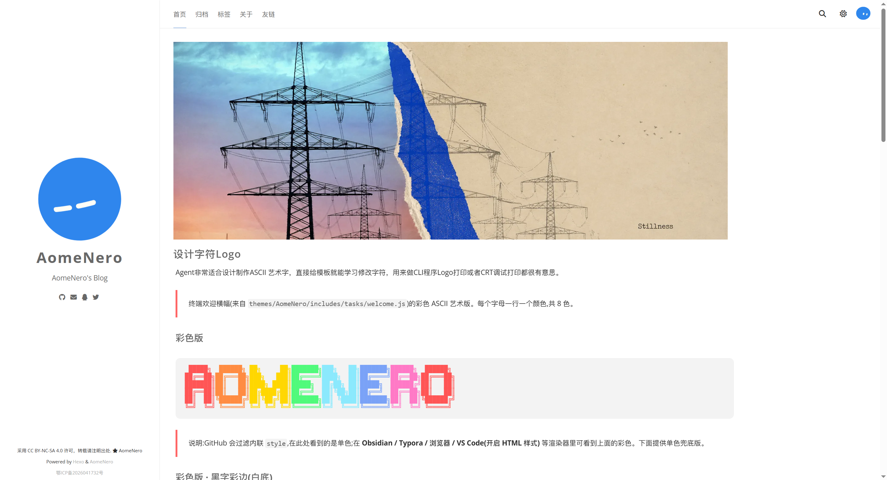

# hexo-theme-AomeNero

A type-safe, lightweight, modern Hexo theme.

AomeNero 的个人博客主题。前端 JS 打包后仅约 40KB，加载极快。



**在线演示**：<https://www.aomenero.com>

**环境要求**：Hexo ≥ 6（在 6/7/8 上验证）· Node ≥ 18 · 任意包管理器（npm / yarn / pnpm 均可）

## 特性

- 现代化前端打包（Rollup + TypeScript + TSX）
- 暗黑模式 / 明暗切换
- 文章概要、文章目录（TOC）支持
- 多语言（I18n）支持
- 可选搜索框（基于 Fuse.js 模糊搜索）
- 可选标签云
- 评论系统支持（Giscus / Valine / Gitalk / Gitment 等，见 `_config.yml`）
- Ajax 无刷新切换页面，减少视觉噪音
- 移动端适配
- 文章版权声明、字数统计、社交账号、备案号、百度统计
- 侧栏动态头像（LaoA GrokBot 表情）
- 文章 banner（front-matter `banner:` 字段）
- banner 圆角可配置（`banner_radius`，默认 `10px`）
- 字体配置化（`_config.yml` 的 `font` 块，渲染时注入 CSS 变量）

## 安装

**方式一：Release 包（推荐，无需 Node 工具链）**

1. 从 GitHub Releases 下载最新的 `hexo-theme-AomeNero-<版本>.zip`（已含构建产物）
2. 解压到博客的 `themes/` 目录，得到 `themes/hexo-theme-AomeNero/`（可自行改名）
3. 跳到下面的「启用」

**方式二：源码构建**

```bash
git clone https://github.com/AomeNero/blog themes/AomeNero
cd themes/AomeNero && npm i && npm run build   # 构建产物 js_complied 不入库,必须执行
```

**启用（两方式通用）**

1. 博客根目录安装 pug 渲染器：`npm i hexo-renderer-pug`（Hexo 约定渲染器装在站点侧）
2. 博客根目录 `_config.yml` 设置 `theme: AomeNero`
3. （可选）个人信息写在博客根目录 `_config.AomeNero.yml`，同名键覆盖主题默认值——主题自带的 `_config.yml` 保持干净默认，方便升级
4. `hexo s` 打开 `http://localhost:4000` 验证

> 主题默认配置不含任何个人信息（备案号/社交账号等均为空）。若 `hexo g` 时想自动编译主题前端，把主题配置里 `build_on_generate` 设为 `true`（需先在主题目录装好依赖）。

## 配置

复制 `_config.example.yml` 为 `_config.yml`，并在 Hexo 根目录的 `_config.yml` 中设置：

```yaml
theme: AomeNero
```

## 开发

进入主题目录，安装依赖后即可构建：

```bash
pnpm i
pnpm build      # 编译 src -> source/js_complied/bundle.{js,css}
pnpm watch      # 监听 src 自动重新编译
pnpm format     # 格式化代码
```

> 构建 bundle 后记得把 `_config.yml` 的 `asset_version` 加一，
> 强制浏览器放弃旧缓存（`head.pug` 以 `?v=` 引用 bundle）。

字体配置：`_config.yml` 的 `font` 块在渲染时由 `head.pug` 注入为
`:root` CSS 变量（`--font-*`），SCSS 侧以 `var(--font-*, 内置默认值)` 消费；
`enable: false` 时全部回落内置 Open Sans 方案。

banner 圆角：`banner_radius` 同样注入为 `--banner-radius`，
SCSS 以 `var(--banner-radius, 10px)` 消费；设为 `0` 恢复直角。

## 目录结构

- `scripts`：主题内置的 Hexo 脚本（`generators` 生成器 / `helpers` 辅助 / `tasks` 任务，由 `index.js` 桥接加载）
- `languages`：I18n 文件
- `layout`：模板，在 `hexo g` 时渲染成 HTML
- `source`：HTML 资产（含编译产物 `js_complied/`）
- `src`：前端 TypeScript 源码，由 rollup 打包为 `js_complied/bundle.js`
- `tools`：维护者脚本（`release.cjs` 发版打包）

## 发版（维护者）

```bash
npm run release   # 构建并打包 → dist/hexo-theme-AomeNero-<版本>.zip
```

把生成的 zip 上传到 GitHub Release 即可——**用户下载解压到 `themes/` 就能用，无需 Node 工具链**（zip 已含构建产物）。git 仓库保持纯源码（`js_complied`、`dist` 均不入库）。

发版前：更新 `CHANGELOG.md`、递增 `package.json` 版本号、提交后打 tag（`git tag v2.1.0 && git push --tags`），Release 标题与 tag 对应。

---

Author: **AomeNero** &lt;yotianya@foxmail.com&gt;  
License: MIT
